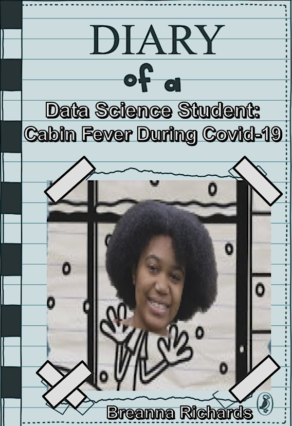
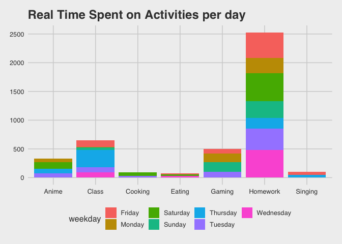
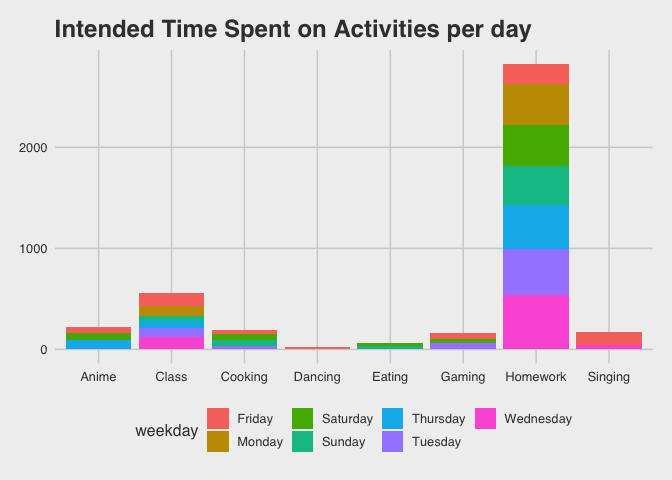
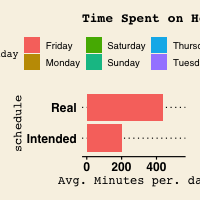
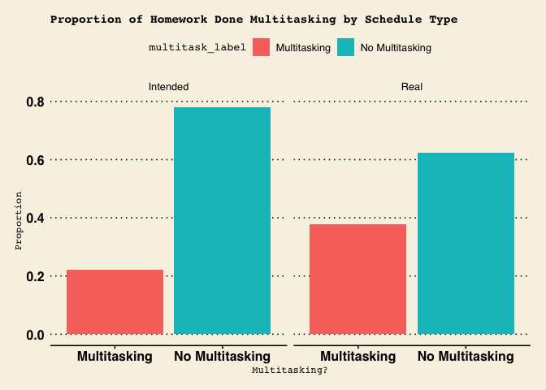
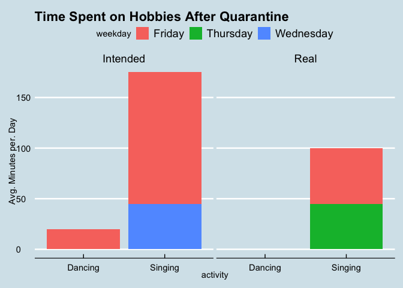
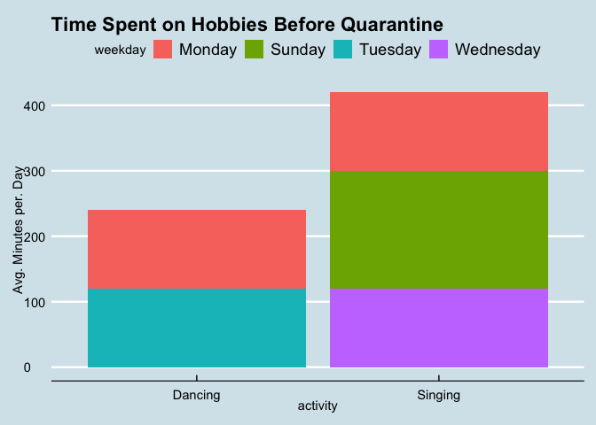

Diary of a... WHO?
==================

Dear Reader,
------------

Most people look forward to Spring Break. But, for Amherst students and
many college students across the country, the start of Spring Break
marked a fundamental change in our lives. For those who circumstances
allowed it, we would be sent home, not for vacation purposes, but to
ride out the rest of our semesters in quarantine.

This diary is dedicated to answering the basic question: "how do I spend
my time?"

For 14 days straight, I used Google Calendar to schedule my time. I
primarily used two different calendars, my intended schedule, and my
real schedule. At the end of each day, I made a schedule of what I
intended to do the next day, and when I intended to do them. Then, I
would record what I actually did during the days in a separate, real
scheudule.

At the end of this two week period, I collected my data for wrangling
and analysis.

### Motivation + primary questions of interest

Here are the primary questions of interest that I wanted to answer at
the end of the two weeks.

-   What activity do I spend most of my time on, on a weekly basis?

-   When (what weekday) do I accomplish the most homework?

-   How much time do I spend multitasking while doing my homework on a
    weekly basis?

-   How much time per week am I spending on my hobbies now, vs. when I
    was on campus?

These questions will also be explored considering what I intended to do
versus what I actually accomplished.

Create a "img" folder within your calendar-project repo and store the
image files there.

Data collection
===============

I collected data by . . .

I can write a bulleted list like this:

-   here's the first thing I want to say
-   and I also want to say this
-   lastly, this

And a numbered list like this:

1.  First thing
2.  Second thing
3.  Third thing

Results
=======

Here's what I found!

Homework
========

Multi-tasking
-------------

Hobbies
=======

