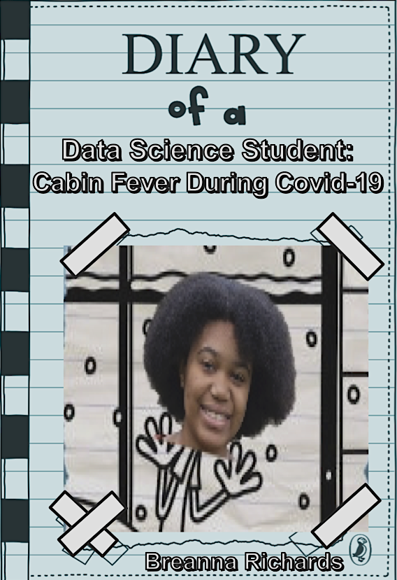
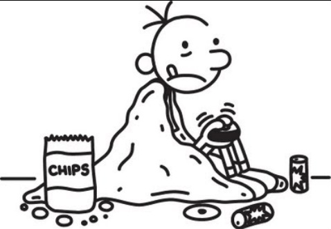

```{r setup, include=FALSE}
knitr::opts_chunk$set(echo = TRUE)
library(tidyverse)
library(lubridate)
library(ical)
library(kableExtra)
library(janitor)
library(reshape2)
library(data.table)
library(ggplot2)
library(ggthemes)
library(gganimate)
library(gifski)
```

```{r, include=FALSE}
# the "include=FALSE" code chunk option suppresses the code and the output from this chunk from appearing in the knit file
# please include your import of the data and any wrangling here
Friday <- c(1, 8, 15)
Saturday <- c(2, 9)
Sunday <- c(3, 10)
Monday <- c(4, 11)
Tuesday <- c(5, 12)
Wednesday <- c(6, 13)
Thursday <- c(7, 14)

#intended schedule
intended <- ical_parse_df(file = "Intended Schedule_amherst.edu_mb1mq097hnqjuolgpc2ussr2l0@group.calendar.google.com.ics") %>%
  mutate(start_datetime = with_tz(start, tzone = "America/New_York")
    , end_datetime = with_tz(end, tzone = "America/New_York")
    , length_sec = (end_datetime - start_datetime)*60
    , length_min = length_sec/60
    , length_hrs = length_min/60
    , date = floor_date(start_datetime, unit = "day"))

intended <- intended %>%
  separate(length_sec, into = c("length_sec", "sec_label"), sep = " ") %>%
  separate(length_min, into = c("length_min", "min_label"), sep = " ") %>%
  separate(length_hrs, into = c("length_hrs", "hrs_label"), sep = " ") %>%
  select(summary, length_sec, length_min, length_hrs, date) %>%
 group_by(date) %>%
  mutate(day_number = group_indices()) %>%
  mutate(weekday = ifelse(day_number %in% Friday, "Friday",
                          ifelse(day_number %in% Saturday, "Saturday",
                                 ifelse(day_number %in% Sunday, "Sunday",
                                       ifelse(day_number %in% Monday, "Monday",
                                              ifelse(day_number %in% Tuesday, "Tuesday",
                                                     ifelse(day_number %in% Wednesday, "Wednesday", "Thursday")))))))%>%
  mutate(activity = case_when(
    str_detect(summary, paste(c('Class', 'Theoretical Stats'), collapse='|')) ~ 'Class',
    str_detect(summary, paste(c('Sing', 'Voice', 'Vocal'), collapse='|')) ~ 'Singing',
    str_detect(summary, paste(c('Eat'), collapse='|')) ~ 'Eating',
    str_detect(summary, paste(c('Cooking', 'Baking'), collapse='|')) ~ 'Cooking',
    str_detect(summary, paste(c('Gaming'), collapse='|')) ~ 'Gaming',
    str_detect(summary, paste(c('HW', 'Homework', 'Work'), collapse='|')) ~ 'Homework',
    str_detect(summary, paste(c('Anime'), collapse='|')) ~ 'Anime',
    str_detect(summary, paste(c('Homework + Gaming'), collapse='|')) ~ 'Homework, Gaming',
    str_detect(summary, paste(c('Homework + Anime'), collapse='|')) ~ 'Homework, Anime',
    str_detect(summary, paste(c('Dancing'), collapse='|')) ~ 'Dancing',
    TRUE~NA_character_))

homework_intended <- intended %>%
  filter(activity == "Homework") %>%
  mutate(multitask = ifelse(summary == "Homework + Anime" | summary == "Homework + Gaming" | summary == "DiffEq Homework + Anime" | summary == "Work + Anime" |  summary == "Data Science Homework + Anime", "TRUE", "FALSE"))

homework_intended[11, "multitask"] <- "TRUE"
homework_intended[, "length_min"] <- as.numeric(as.character(unlist(homework_intended[, "length_min"])))

intended <- intended %>%
  select(-summary)

intended[, "length_min"] <- as.numeric(as.character(unlist(intended[, "length_min"])))
intended[, "length_sec"] <- as.numeric(as.character(unlist(intended[, "length_sec"])))
intended[, "length_hrs"] <- as.numeric(as.character(unlist(intended[, "length_hrs"])))

#INTENDED SCHEDULE

intend_grouped <- intended %>%
  group_by(weekday, activity) %>%
  summarise(total_min = sum(length_min))  %>%
  #since we have 3 fridays and 2 of every other day
  mutate(min_spent_per_day = ifelse(weekday == "Friday", (total_min/3), total_min/2))


```

```{r,  include=FALSE}
#real schedule
real <- ical_parse_df(file = "Real Schedule_amherst.edu_gbbcepto5ijkmcfd70bv318bhc@group.calendar.google.com.ics") %>%
  mutate(start_datetime = with_tz(start, tzone = "America/New_York")
    , end_datetime = with_tz(end, tzone = "America/New_York")
    , length_sec = (end_datetime - start_datetime)*60
    , length_min = length_sec/60
    , length_hrs = length_min/60
    , date = floor_date(start_datetime, unit = "day"))


real <- real %>%
  separate(length_sec, into = c("length_sec", "sec_label"), sep = " ") %>%
  separate(length_min, into = c("length_min", "min_label"), sep = " ") %>%
  separate(length_hrs, into = c("length_hrs", "hrs_label"), sep = " ") %>%
  select(summary, length_sec, length_min, length_hrs, date) %>%
 group_by(date) %>%
  mutate(day_number = group_indices()) %>%
  mutate(weekday = ifelse(day_number %in% Friday, "Friday",
                          ifelse(day_number %in% Saturday, "Saturday",
                                 ifelse(day_number %in% Sunday, "Sunday",
                                       ifelse(day_number %in% Monday, "Monday",
                                              ifelse(day_number %in% Tuesday, "Tuesday",
                                                     ifelse(day_number %in% Wednesday, "Wednesday", "Thursday"))))))) %>%
  mutate(activity = case_when(
    str_detect(summary, paste(c('Class', 'Theoretical Stats'), collapse='|')) ~ 'Class',
    str_detect(summary, paste(c('Sing', 'Voice'), collapse='|')) ~ 'Singing',
    str_detect(summary, paste(c('Eat'), collapse='|')) ~ 'Eating',
    str_detect(summary, paste(c('Cooking'), collapse='|')) ~ 'Cooking',
    str_detect(summary, paste(c('Gaming'), collapse='|')) ~ 'Gaming',
    str_detect(summary, paste(c('HW', 'Homework'), collapse='|')) ~ 'Homework',
    str_detect(summary, paste(c('Anime'), collapse='|')) ~ 'Anime',
    str_detect(summary, paste(c('Homework + Gaming'), collapse='|')) ~ 'Homework, Gaming',
    str_detect(summary, paste(c('Homework + Anime'), collapse='|')) ~ 'Homework, Anime',
    TRUE~NA_character_)) 

homework_real <- real %>%
  filter(activity == "Homework") %>%
  mutate(multitask = ifelse(summary == "Homework + Anime" | summary == "Homework + Gaming" | summary == "DiffEq Homework + Anime" |  summary == "Data Science Homework + Anime" | summary == "DiffEq Homework + Anime ", "TRUE", "FALSE"))

homework_real[21, "multitask"] <- "TRUE"
homework_real[, "length_min"] <- as.numeric(as.character(unlist(homework_real[, "length_min"])))

real <- real %>%
  select(-summary)

real[, "length_min"] <- as.numeric(as.character(unlist(real[, "length_min"])))
real[, "length_sec"] <- as.numeric(as.character(unlist(real[, "length_sec"])))
real[, "length_hrs"] <- as.numeric(as.character(unlist(real[, "length_hrs"])))

#REAL SCHEDULE
real_grouped <- real %>%
  group_by(weekday, activity) %>%
  summarise(total_min = sum(length_min))%>%
  mutate(min_spent_per_day = ifelse(weekday == "Friday", (total_min/3), total_min/2))

```


# Cabin Fever During Covid-19: How Am I Spending My Time?





## Dear Reader,
Most people look forward to Spring Break. But, for Amherst students and many college students across the country, the start of Spring Break 2020 marked a fundamental change in our lives. 
\newline
For those whose circumstances allowed, we would be sent home to ride out the rest of the semester in quarantine. 

This diary is dedicated to answering the basic question: "how do I spend my time?"

For 14 days straight, I used Google Calendar to schedule my time. I primarily used two different calendars, my intended schedule, and my real schedule. More specifically, at the end of each day, I made a schedule of the tasks that I intended to do the next day, and when I intended to do them. 
Then, during the days, I would record what I actually did in a separate scheudule. 

At the end of this two week period, I collected my data for wrangling and analysis.

###Motivation + Primary Questions of Interest
Here are the primary questions of interest that I wanted to answer at the end of the two weeks.

- On a weekly basis, what activity do I spend most of my time on? 

- When (what weekday) do I accomplish the most homework?

- How much time per. week do I spend multitasking while doing my homework?

- How much time per week am I spending on my hobbies now, vs. when I was on campus?

These questions will also be explored considering the scope of my two schedules - what I intended to do versus what I actually accomplished. 


## Results

Here's what I found!!!


First, I took a look at an overview of the activities that I plotted in my intended and real calendars, and how much time I alloted for each task. 

I chose to measure my time in minutes. Note that instead of plotting total amount of time spent over the two weeks, I decided to plot average time spent on these activities per weekday, so that I could look at what I would expect my time distribution to be for a single week. For example, if I spent 120 minutes in total watching anime on Mondays, I would only plot 120/2 = 60 minutes for Monday (Note: since I collected data for 3 Fridays, Friday total time would be divided by 3 instead of 2). We can first observe what I intended to accomplish.


I can see from the bar chart below that the majority of my week was planned to be spent on doing homework. My schedule shows that I intended to clock in 2,825 minutes or 47.08 hours a week just working on homework! (Wow!) Given, this was a very busy time in the semester, so that may explain it. Notably, I also intended to do most of my homework on Wednesdays, and do the least amount on Fridays. 

\newline
Coming in at second place is class time. I intended to spend 557.5 minutes per week in class, which is about 9.3 hours. That's pretty much in line with how often/how long my classes are collectively scheduled to be.  
\newline
Next, my hobbies were sprinkled into my schedule, which I'll take a more in-depth look at later in the report. Just from a glance, it seems that I intended to spend about the same amount of time watching anime, cooking, gaming, and singing per week. I have some scheduled dancing time sprinkled in there as well. 


```{r, echo=FALSE, fig.height=6, fig.width=7}
# the "echo=FALSE" code chunk option suppresses the code from this chunk from appearing in the knit file, but the code will still evaluate and the output will show up in the knit file

ggplot(data = intend_grouped, aes(x = activity, y = min_spent_per_day, fill = weekday)) + geom_col() + labs(y = "Avg. Minutes per. day", title = "Intended Time Spent on Activities per day") + theme_bw() + theme(axis.text.x = element_text(angle = -85)) + theme_fivethirtyeight() + theme(axis.title=element_text(size=9))
```


Now on to what I actually accomplished. As far as distributions go, I accomplished more or less what I intended to do, with some variation. Homework still clocks in as the activity that takes up most of my time on a weekly basis. However, it seems that I spent less time doing homework than I intended to. I really spent an average of 2,525 minutes, 42.08 hours, per week doing homework. Even if it's just a 5 hour difference, I learned that my school work took me less time than I thought it would take me. 42.08 hours a week is already enough time dedicated to sitting in my chair and typing/writing away at my assignments, so I'm glad that I may have gotten the opportunity to spend more time on my hobbies.

```{r, echo = FALSE}


ggplot(data = real_grouped, aes(x = activity, y = min_spent_per_day, fill = weekday)) + geom_col()+ labs(y = "Avg. Minutes per. day", title = "Real Time Spent on Activities per day") + theme_bw() + theme(axis.text.x = element_text(angle = -85)) + theme_fivethirtyeight()+ theme(axis.title=element_text(size=9))


```

###Homework


What's interesting here though, is even though I spent the most time doing homework on Wednesdays as I intended, I actually spent the same amount of time doing homework on Saturdays as well (480 minutes/ 8 hours each). Furthermore, as I expected to do the least amount of homework on Fridays, I actually did almost the same amount of homework on Fridays as I did on Wednesdays and Saturdays. I actually did the least amount of homework on Thursdays. 
\newline
The animated bar chart and table below look at homework more closely, and highlights the differences between my two schedules.


```{r, echo=FALSE, fig.height=7, fig.width=9, cache=TRUE}

real_grouped_homework <- real_grouped %>%
  filter(activity == "Homework") 

intend_grouped_homework <- intend_grouped %>%
  filter(activity == "Homework") 

grouped_homework_col <- cbind(real_grouped_homework, intend_grouped_homework)

real_grouped_homework <- real_grouped_homework %>%
  mutate(schedule = "Real")
intend_grouped_homework <- intend_grouped_homework %>%
  mutate(schedule = "Intended")


grouped_homework_df <- rbind(real_grouped_homework, intend_grouped_homework)

myPlot <- ggplot(data = grouped_homework_df, aes(x = schedule, y = min_spent_per_day, fill = weekday)) + geom_col() + coord_flip() + labs(y = "Avg. Minutes per. day", title = "Time Spent on Homework per Day") + theme_wsj() + theme(plot.title = element_text(size=13), legend.title = element_text(size=10)) + theme(axis.title=element_text(size=12)) +
  # gganimate specific bits:
  transition_states(
    weekday,
    transition_length = 2,
    state_length = 1
  ) +
  ease_aes('sine-in-out')

# Save at gif:
animate(myPlot, duration = 8, fps = 20, width = 550, height = 500, renderer = gifski_renderer())
anim_save("output.gif")

grouped_homework_col <- grouped_homework_col%>%
  select(weekday, min_spent_per_day, min_spent_per_day1)
```


| Table 1: Time Doing Homework by Schedule per. Day |                       |                           |
|---------------------------------------------------|-----------------------|---------------------------|
| Weekday                                           | Real Avg. Minutes/day | Intended Avg. Minutes/day |
| Friday                                            | 440                   | 200                       |
| Monday                                            | 270                   | 405                       |
| Saturday                                          | 480                   | 405                       |
| Sunday                                            | 300                   | 390                       |
| Thursday                                          | 180                   | 435                       |
| Tuesday                                           | 375                   | 450                       |
| Wednesday                                         | 480                   | 540                       |


Coming in second place, as expected, is class time. Evidently, I spent on average, 647.5 minutes or 10.8 hours, in class per week. That is about 1.5 hours more than what I intended. Note that I also counted office hours as 'class time', so that would probably explain this difference.
\newline

My hobbies were actually sprinkled into my schedule, but lo and behold, I actually spent more time gaming and watching anime than I intended, but less time singing, cooking, and dancing than I intended. In fact, I didn't get to dance at all!


###Homework and Multi-tasking 

Now, let's focus in on homework and multitasking. I decided to do this because I had a unique multitaking element to doing homework that I didn't list for any other activity in my schedules. When I was just doing homework, I marked that activity as 'Homework'. But when I did homework at the same time as another activity, I would mark it as 'Homework + (insert activity here)'. In my case, the other activity was always either watching anime or gaming. 
\newline

The bar chart below gives me insight into the proportion of homework that I did while multitasking (or not), faceted by what I intended to do and what I actually did. 
\newline
It looks like I intended to multitask on less of a proportion of my homework than I actually did. More specifically, I intended to multitask 22% of the time I was doing my homework, but actually multitasked 37.7% of the time. 
\newline
Being that I spent less time on homework than I intended to overall, it may be safe to say that multitasking did not make me spend more time on my homework. In fact, maybe having something in the background, like a show or game, kept me focused. I noticed in the past that I tend to do really well with studying and work when I have one of my favorite shows playing as my 'homework-soundtrack'.
The barchart and table below show my results more clearly. 

```{r, echo=FALSE, message = FALSE}

homework_real <- homework_real %>%
  select(length_min, multitask)%>%
  group_by(multitask) %>%
  summarise(total_min = sum(length_min))

homework_intended <- homework_intended %>%
  select(length_min, multitask) %>%
  group_by(multitask) %>%
  summarise(total_min = sum(length_min))

homework_real2 <- homework_real %>%
  mutate(schedule = "Real",
         prop = total_min/sum(total_min))

homework_intended2 <- homework_intended %>%
  mutate(schedule = "Intended",
          prop = total_min/sum(total_min))

#row 1-27 is homework real
#row 28-59 is homework intended
homework_df <- rbind(homework_real2, homework_intended2)

homework_df <- homework_df %>%
  mutate(multitask_label = ifelse(multitask == "TRUE", "Multitasking",
                                  "No Multitasking"))


  ggplot(data = homework_df, aes(x = multitask_label, y = prop, fill = multitask_label)) + geom_col() + facet_grid(~schedule) + labs(x = "Multitasking?", y = "Proportion", title = "Proportion of Homework Done Multitasking by Schedule Type") + theme_bw() + theme(axis.text.x = element_text(angle = -15)) + theme(legend.position = "none") + theme_wsj() + theme(plot.title = element_text(size=11), legend.title = element_text(size=10)) + theme(axis.title=element_text(size=9))
```

```{r, echo=FALSE}

#real homework proportions multitasking vs. not

homework_df_show <- cbind(homework_real2, homework_intended2)
homework_real2 <- homework_real2 %>%
  rename(
     total_min_real = total_min,
     schedule_real = schedule,
       prop_real = prop
  )
homework_intended2 <- homework_intended2 %>%
  rename(
    multitask_int = multitask,
     total_min_int = total_min,
     schedule_int = schedule,
       prop_int = prop
  )

homework_df_show <- cbind(homework_real2, homework_intended2)


homework_df_show <- homework_df_show %>%
  select(prop_real, prop_int)


setattr(homework_df_show, "row.names", c("No Multitasking", "Multitasking"))


```


| Table 2: Doing Homework with and w/o Multitasking |                 |                     |
|---------------------------------------------------|-----------------|---------------------|
|                                                   | Real Proportion | Intended Proportion |
| No Multitasking                                   | 0.6229508       | 0.7794872           |
| Multitasking                                      | 0.3770492       | 0.2205128           |

###Hobbies


Finally, we move on to my hobbies. In addition to plotting how much time I intended to spend/actually did spend on my hobbies, for comparison purposes, I also plotted how much time I spent on my hobbies when I was on campus. 
\newline
Even though I didn't use a calendar when on campus, I was able to record this data because my hobbies were fine tuned to a set schedule every week. This is because I did them in clubs! I was able to plot the time that I spent based on when and for how long my recreational clubs would meet each week.
\newline
I decided to only focus on dancing and singing, since they were the hobbies that I engaged in the most when I was at school.

We can tell from the bar chart below that while I intended to allocate more time for singing and dancing per week, overall, I actually spent a lot less time engaging in those activities.

\newline
I really do enjoy singing and dancing, and I hope that this revelation motivates me to spend more time on the things that I enjoy the most. 
\newline


```{r, echo=FALSE, fig.width=7, fig.height=6}
real_hobbies <- real_grouped%>%
  filter(activity == "Dancing" | activity == "Singing") %>%
  mutate(schedule = "Real")

intend_hobbies <- intend_grouped %>%
  filter(activity == "Dancing" | activity == "Singing") %>%
  mutate(schedule = "Intended")

hobbies_df <- rbind(real_hobbies, intend_hobbies) 
 

ggplot(hobbies_df, aes(x = activity, y = min_spent_per_day, fill = weekday)) + geom_col() + facet_wrap(~ schedule) + theme_bw() + labs(y = "Avg. Minutes per. Day", title = "Time Spent on Hobbies During Quarantine") + theme_economist() 

#Before Quarentine
weekday <- c("Sunday", "Monday", "Monday", "Tuesday", "Wednesday")
activity <- c("Singing", "Singing", "Dancing", "Dancing", "Singing")
min_spent_pday <- c(180, 120, 120, 120, 120)

hobbies_bquarentine <- data.frame(weekday, activity, min_spent_pday)

```

While I intended to dance for about 20 minutes each Friday, I ended up doing no dancing at all. This makes sense for me personally since I haven't been feeling particularly driven to move around since quarantine began. 
\newline
Similarly, I planned to sing for 45 minutes on Wednesdays and 130 minutes on Fridays. However, what really happened is I didn't sing at all on Wednesdays, and on Fridays, I only spent 55 minutes singing. I also indulged in singing on Thursdays for about 45 minutes, which I did not originally plan to do.


```{r, echo = FALSE, fig.width=7, fig.height=6}

#new one
ggplot(hobbies_df, aes(x = weekday, y = min_spent_pday, fill = weekday)) + geom_segment(aes(x = weekday, xend = weekday, y = 0, yend = min_spent_pday), color = "grey") + geom_point(color = "orange", size = 4)  + facet_wrap(~schedule) + labs(title = "Time Spent on Hobbies During Quarantine", y = "Avg. Minutes per. Day")+ theme(plot.title = element_text(size=2)) + theme_economist() 
```

As mentioned before, I can compare my time spent on hobbies during quarantine to my time spent on hobbies before quarantine. Before quarantine, I was spending 7 hours a week singing with my acapella group at Amherst: 3 hours on Sunday, 2 on Monday, and 2 on Wednesday. I also spent 4 hours a week dancing with the African Caribbean Student Union on campus: 2 hours on Monday, and 2 on Tuesday. 

Evidently, my dancing productivity has gone down by 4 hours a week, and my singing productivity has gone down by 320 minutes, or 5.33 hours a week. :(

```{r, echo = FALSE}

ggplot(hobbies_bquarentine, aes(x = activity, y = min_spent_pday, fill = weekday)) + geom_col()  + labs(title = "Time Spent on Hobbies Before Quarantine", y = "Avg. Minutes per. Day") + theme_economist() 


```

##Answering My Questions of Interest:

On a weekly basis, what activity do I spend most of my time on?
\newline

- On a weekly basis, I spend most of my time doing homework. I spend a little less time on homework than I intend to.

When (what weekday) do I accomplish the most homework?
\newline

- I accomplish the most homework on Wednesdays and Saturdays.

How much time per week do I spend multitasking while doing my homework?
\newline

- I multitask on homework more than I intend to. While I intend to multitask about 22% of the time, I actually end up multitasking 37.7% of the time. 

How much time per week am I spending on my hobbies now, vs. when I was on campus?
\newline

- In total, I'm spending 100 minutes a week on hobbies, although I intend to spend 195 minutes a week. Before quarentine, I spent 660 minutes per week on hobbies, 560 more than I'm spending now.


##Reflection

This project has been extremely insightful to looking at how I spend my time. With this insight, I think I'm going to continue to use Google Calendar to budget my time, and to get a better idea of what I can do to adjust my intended schedule in order to influence what I ultimately get done in the end. To be more specific, I'm looking to spend more time on my hobbies, especially since summer vacation is coming up soon! 

As someone who provides data, I expect that consumer data is being collected responsibly in line with laws, regulations, and the expectations of those who are having their data collected. I expect that my data be treated with care and not used inappropriately, such as being sold to sketchy third-parties. I also expect that my data is used in a fair way and only for a purpose related to company activities. Finally, I would hope that privacy policies are respected and accurately outlined to me.

As people who analyze others' data, I think statisticians have an absolute responsibility to uphold the protection and privacy of consumers' data. Data handlers must not collect data unneccessarily or excessively, sell the data, or indulge in activities that enable or facilitate illegitimate or unauthorized access to data. One of the biggest things that a data collector must master is communication. All data collectors must inform consumers about data breach possibilities and about what data are stored. Transparency is key for a respectable relationship between consumer and statistician/data collector. 

