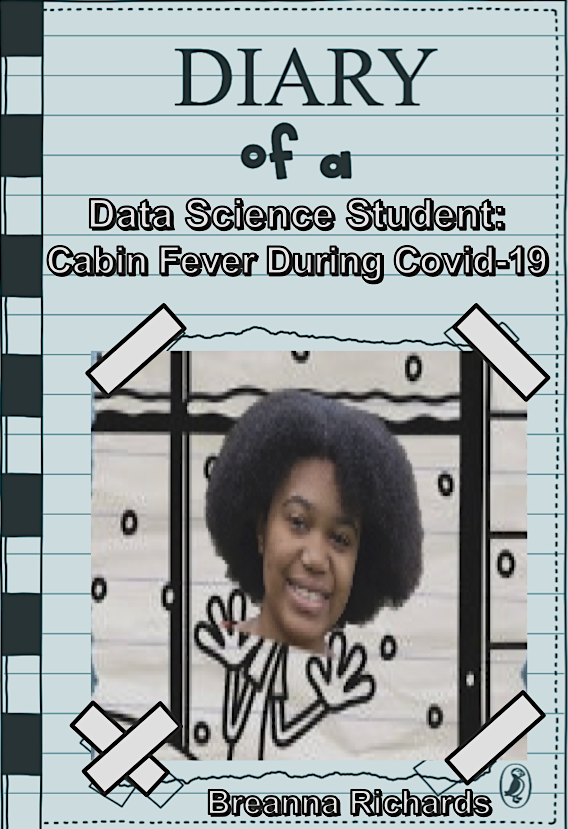
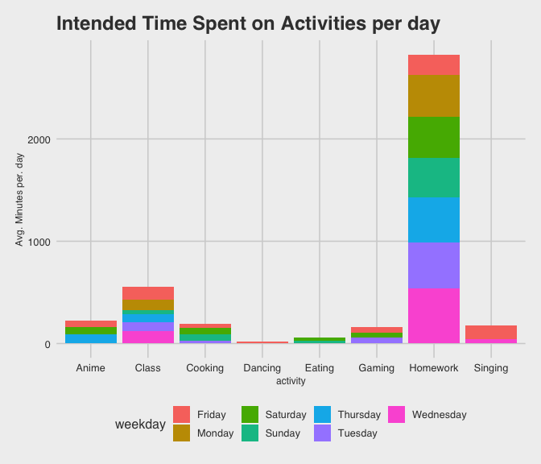
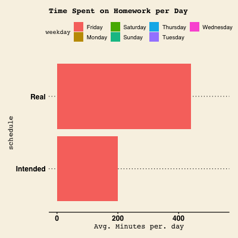
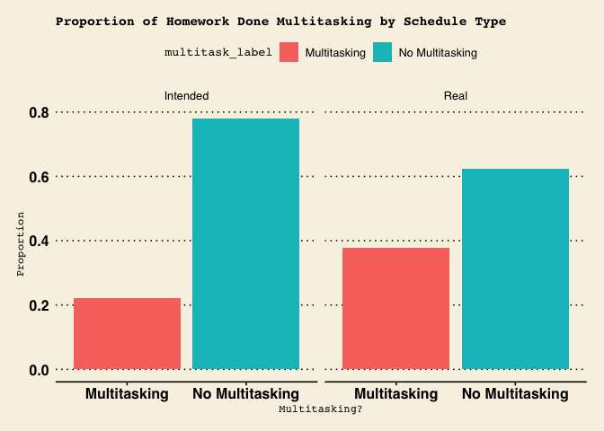
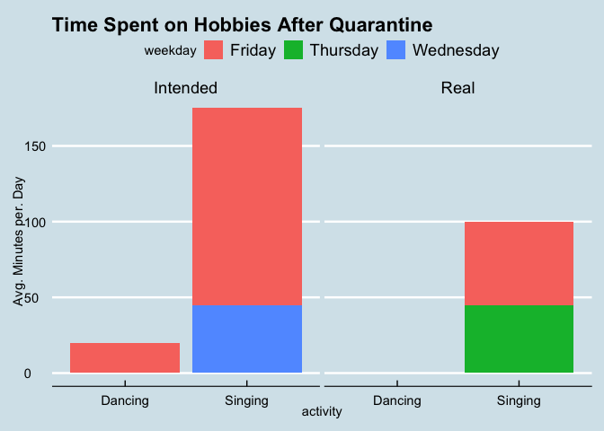
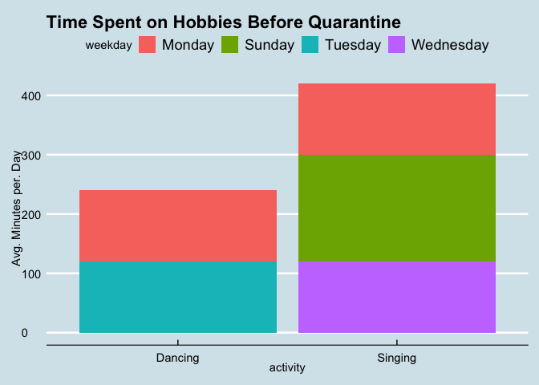

Diary of a... WHO?
==================

Dear Reader,
------------

Most people look forward to Spring Break. But, for Amherst students and
many college students across the country, the start of Spring Break
marked a fundamental change in our lives. For those who circumstances
allowed it, we would be sent home, not for vacation purposes, but to
ride out the rest of our semesters in quarantine.

This diary is dedicated to answering the basic question: "how do I spend
my time?"

For 14 days straight, I used Google Calendar to schedule my time. I
primarily used two different calendars, my intended schedule, and my
real schedule. At the end of each day, I made a schedule of what I
intended to do the next day, and when I intended to do them. Then, I
would record what I actually did during the days in a separate, real
scheudule.

At the end of this two week period, I collected my data for wrangling
and analysis.

### Motivation + primary questions of interest

Here are the primary questions of interest that I wanted to answer at
the end of the two weeks.

-   What activity do I spend most of my time on, on a weekly basis?

-   When (what weekday) do I accomplish the most homework?

-   How much time do I spend multitasking while doing my homework on a
    weekly basis?

-   How much time per week am I spending on my hobbies now, vs. when I
    was on campus?

These questions will also be explored considering what I intended to do
versus what I actually accomplished.

Results
=======

Here's what I found!

insert image here
=================

First, I took a look at an overview of the activities that I plotteed in
my intended and real calendars, and how much time I alloted for each
task.

I chose to measure my time in minutes. Note that instead of plotting
total amount of time spent over the two weeks, I decided to plot average
time spent on these activities per weekday, so that I could look at what
I would expect my time distribution to be for a single week (for
example, if I spent 120 minutes in total watching anime on Mondays, I
would only plot 120/2 = 60 minutes for Monday). We can first observe
what I intended to accomplish.

I can see from the bar chart below that the majority of my week was
planned to be spent on doing homework. My schedule shows that I intended
to clock in 2,825 minutes or 47.08 hours a week just working on
homework! (Wow!) Given, this was a very busy time in the semester, so
that may explain it. Notably, I also intended to do most of my homework
on Wednesdays, and do the least amount on Fridays.

Coming in at second place is class time. I intended to spend 557.5
minutes per week in class, which is about 9.3 hours. That's pretty much
in line with how often/how long my classes are collectively scheduled to
be.  
Next, my hobbies were sprinkled into my schedule, which I'll take a more
in-depth look at later in the report. Just from a glance, it seems that
I intended to spend about the same amount of time watching anime,
cooking, gaming, and singing per week. I have some scheduled dancing
time sprinkled in there as well.

    ## [1] 90

    ## # A tibble: 2 x 4
    ## # Groups:   weekday [2]
    ##   weekday  activity total_min min_spent_per_day
    ##   <chr>    <chr>        <dbl>             <dbl>
    ## 1 Saturday Cooking        120                60
    ## 2 Tuesday  Cooking         60                30

    ## [1] 190

Now on to what I actually accomplished. As far as distributions go, I
accomplished more or less what I intended to do, with some variation.

Homework still clocks in as the activity that takes up most of my time
on a weekly basis. However, it seems that I spent less time than I
intended to doing homework. I really spent an average of 2,525 minutes,
42.08 hours, per week doing homework. Even if it's just a 5 hour
difference, I learned that my school work took me less time than I
thought it would take me. 42.08 hours a week is already enough time
dedicated to sitting in my chair and typing/writing away at my
assignments, so I'm glad that I may have gotten the opportunity to spend
more time on my hobbies. What's interesting here though, is even though
I spent the most time doing homework on Wednesdays as I intended, I
actually spent the same amount of time doing homework on Saturdays as
well (480 minutes/ 8 hours each). Furthermore, as I expected to do the
least amount of homework on Fridays, I actually did almost the same
amount of homework on Fridays as I did on Wednesdays and Saturdays. I
actually did the least amount of homework on Thursdays. The animated bar
chart and table below look at homework more closely, and highlight the
differences between my two schedules.

Coming in second place, as expected, is class time. Evidently, I spent
on average, 647.5 minutes or 10.8 hours in class per week. That is about
1.5 hours more than what I intended. Note that I also counted office
hours as 'class time', so that would probably explain this difference.

My hobbies were actually sprinkled into my schedule, but lo and behold,
I actually spent more time gaming and watching anime than I intended,
but less time singing, cooking, and dancing than I intended. In fact, I
didn't get to dance at all!

Homework and Multi-tasking
--------------------------

Now, let's focus in on homework and multitasking. I decided to do this,
because I had a unique multitaking element to doing homework, that I
didn't list for any other activity in my schedules. When I was just
doing homework, I marked that activity as 'Homework'. But when I did
homework at the same time as another activity, I would mark it as
'Homework + \[insert activity here\]'. In my case, the other activity
was always either watching anime or gaming.

Hobbies
=======

Reflection
==========
