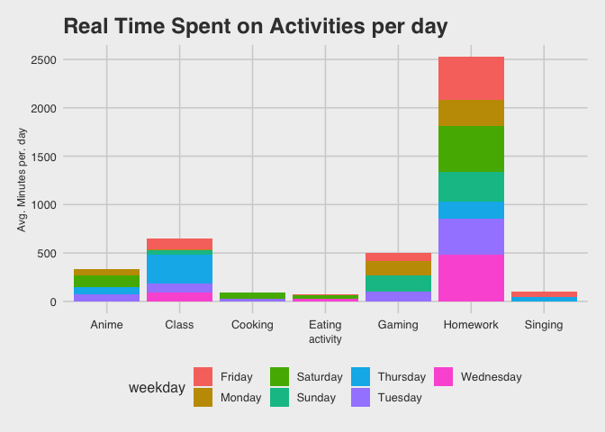
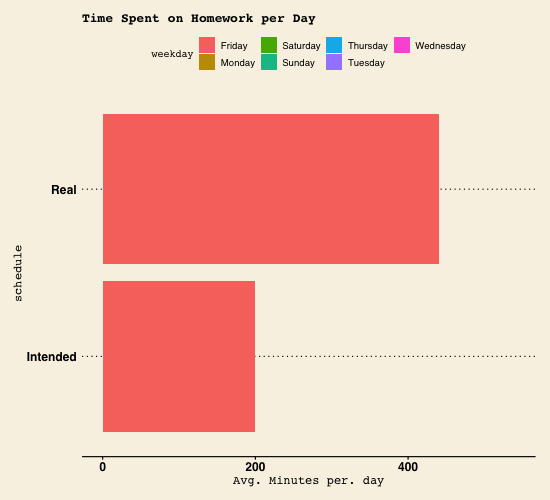
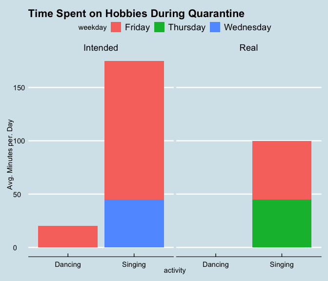
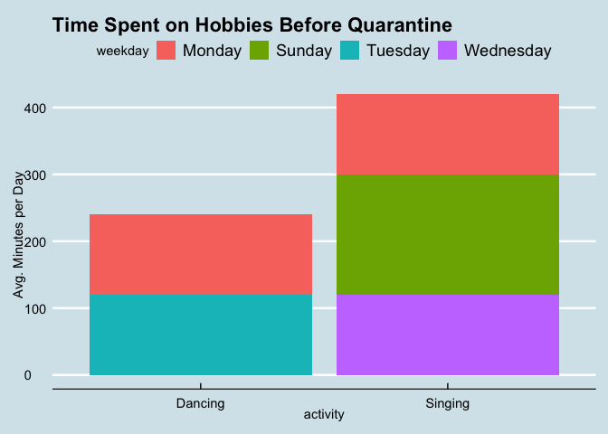

Cabin Fever During Covid-19: How Am I Spending My Time?
=======================================================

Dear Reader,
------------

Most people look forward to Spring Break. But, for Amherst students and
many college students across the country, the start of Spring Break 2020
marked a fundamental change in our lives. For those whose circumstances
allowed, we would be sent home to ride out the rest of the semester in
quarantine.

This diary is dedicated to answering the basic question: "how do I spend
my time?"

For 14 days straight, I used Google Calendar to schedule my time. I
primarily used two different calendars, my intended schedule, and my
real schedule. More specifically, at the end of each day, I made a
schedule of the tasks that I intended to do the next day, and when I
intended to do them. Then, during the days, I would record what I
actually did in a separate schedule.

At the end of this two week period, I collected my data for wrangling
and analysis.

### Motivation + Primary Questions of Interest

Here are the primary questions of interest that I wanted to answer at
the end of the two weeks.

-   On a weekly basis, what activity do I spend most of my time on?

-   When (what weekday) do I accomplish the most homework?

-   How much time per week do I spend multitasking while doing my
    homework?

-   How much time per week am I spending on my hobbies now, vs. when I
    was on campus?

These questions will also be explored considering the scope of my two
schedules - what I intended to do versus what I actually accomplished.

Results
-------

Here's what I found!!!

First, I took a look at an overview of the activities that I plotted in
my intended and real calendars, and how much time I alloted for each
task.

I chose to measure my time in minutes. Note that instead of plotting
total amount of time spent over the two weeks, I decided to plot average
time spent on these activities per weekday, so that I could look at what
I would expect my time distribution to be for a single week. For
example, if I spent 120 minutes in total watching anime on Mondays, I
would only plot 120/2 = 60 minutes for Monday (Note: since I collected
data for 3 Fridays, Friday total time would be divided by 3 instead of
2). We can first observe what I intended to accomplish.

I can see from the bar chart below that the majority of my week was
planned to be spent on doing homework. My schedule shows that I intended
to clock in 2,825 minutes or 47.08 hours a week just working on
homework! (Wow!) Given, this was a very busy time in the semester, so
that may explain it. Notably, I also intended to do most of my homework
on Wednesdays, and do the least amount on Fridays.

Coming in at second place is class time. I intended to spend 557.5
minutes per week in class, which is about 9.3 hours. That's pretty much
in line with how often/how long my classes are collectively scheduled to
be.  
Next, my hobbies were sprinkled into my schedule, which I'll take a more
in-depth look at later in the report. Just from a glance, it seems that
I intended to spend about the same amount of time watching anime,
cooking, gaming, and singing per week. I have some scheduled dancing
time sprinkled in there as well.

Now on to what I actually accomplished. As far as distributions go, I
accomplished more or less what I intended to do, with some variation.
Homework still clocks in as the activity that takes up most of my time
on a weekly basis. However, it seems that I spent less time doing
homework than I intended to. I really spent an average of 2,525 minutes,
42.08 hours, per week doing homework. Even if it's just a 5 hour
difference, I learned that my school work took me less time than I
thought it would take me. 42.08 hours a week is already enough time
dedicated to sitting in my chair and typing/writing away at my
assignments, so I'm glad that I may have gotten the opportunity to spend
more time on my hobbies.

### Homework

What's interesting here though, is even though I spent the most time
doing homework on Wednesdays as I intended, I actually spent the same
amount of time doing homework on Saturdays as well (480 minutes/ 8 hours
each). Furthermore, as I expected to do the least amount of homework on
Fridays, I actually did almost the same amount of homework on Fridays as
I did on Wednesdays and Saturdays. I actually did the least amount of
homework on Thursdays. The animated bar chart and table below look at
homework more closely, and highlights the differences between my two
schedules.

<table>
<thead>
<tr class="header">
<th>Table 1: Time Doing Homework by Schedule per Day</th>
<th></th>
<th></th>
</tr>
</thead>
<tbody>
<tr class="odd">
<td>Weekday</td>
<td>Real Avg. Minutes/day</td>
<td>Intended Avg. Minutes/day</td>
</tr>
<tr class="even">
<td>Friday</td>
<td>440</td>
<td>200</td>
</tr>
<tr class="odd">
<td>Monday</td>
<td>270</td>
<td>405</td>
</tr>
<tr class="even">
<td>Saturday</td>
<td>480</td>
<td>405</td>
</tr>
<tr class="odd">
<td>Sunday</td>
<td>300</td>
<td>390</td>
</tr>
<tr class="even">
<td>Thursday</td>
<td>180</td>
<td>435</td>
</tr>
<tr class="odd">
<td>Tuesday</td>
<td>375</td>
<td>450</td>
</tr>
<tr class="even">
<td>Wednesday</td>
<td>480</td>
<td>540</td>
</tr>
</tbody>
</table>

Coming in second place, as expected, is class time. Evidently, I spent
on average 647.5 minutes or 10.8 hours, in class per week. That is about
1.5 hours more than what I intended. Note that I also counted office
hours as 'class time', so that would probably explain this difference.

My hobbies were actually sprinkled into my schedule, but lo and behold,
I actually spent more time gaming and watching anime than I intended,
but less time singing, cooking, and dancing than I intended. In fact, I
didn't get to dance at all!

### Homework and Multitasking

Now, let's focus on homework and multitasking. I decided to do this
because I had a unique multitasking element to doing homework that I
didn't list for any other activity in my schedules. When I was just
doing homework, I marked that activity as 'Homework'. But when I did
homework at the same time as another activity, I would mark it as
'Homework + (insert activity here)'. In my case, the other activity was
always either watching anime or gaming.

The bar chart below gives me insight into the proportion of homework
that I did while multitasking (or not), faceted by what I intended to do
and what I actually did. It looks like I intended to multitask on less
of a proportion of my homework than I actually did. More specifically, I
intended to multitask 22% of the time I was doing my homework, but
actually multitasked 37.7% of the time. Being that I spent less time on
homework than I intended to overall, it may be safe to say that
multitasking did not make me spend more time on my homework. In fact,
maybe having something in the background, like a show or game, kept me
focused. I noticed in the past that I tend to do really well with
studying and work when I have one of my favorite shows playing as my
'homework-soundtrack'. The bar chart and table below show my results
more clearly.

<table>
<thead>
<tr class="header">
<th>Table 2: Doing Homework with and w/o Multitasking</th>
<th></th>
<th></th>
</tr>
</thead>
<tbody>
<tr class="odd">
<td></td>
<td>Real Proportion</td>
<td>Intended Proportion</td>
</tr>
<tr class="even">
<td>No Multitasking</td>
<td>0.6229508</td>
<td>0.7794872</td>
</tr>
<tr class="odd">
<td>Multitasking</td>
<td>0.3770492</td>
<td>0.2205128</td>
</tr>
</tbody>
</table>

### Hobbies

Finally, we move on to my hobbies. In addition to plotting how much time
I intended to spend/actually did spend on my hobbies, for comparison
purposes, I also plotted how much time I spent on my hobbies when I was
on campus. Even though I didn't use a calendar when on campus, I was
able to record this data because my hobbies were fine tuned to a set
schedule every week. This is because I did them in clubs! I was able to
plot the time that I spent based on when and for how long my
recreational clubs would meet each week. I decided to only focus on
dancing and singing, since they were the hobbies that I engaged in the
most when I was at school.

We can tell from the bar chart below that while I intended to allocate
more time for singing and dancing per week, overall, I actually spent a
lot less time engaging in those activities.

I really do enjoy singing and dancing, and I hope that this revelation
motivates me to spend more time on the things that I enjoy the most.

While I intended to dance for about 20 minutes each Friday, I ended up
doing no dancing at all. This makes sense for me personally since I
haven't been feeling particularly driven to move around since quarantine
began. Similarly, I planned to sing for 45 minutes on Wednesdays and 130
minutes on Fridays. However, what really happened is I didn't sing at
all on Wednesdays, and on Fridays, I only spent 55 minutes singing. I
also indulged in singing on Thursdays for about 45 minutes, which I did
not originally plan to do.

As mentioned before, I can compare my time spent on hobbies during
quarantine to my time spent on hobbies before quarantine. Before
quarantine, I was spending 7 hours a week singing with my acapella group
at Amherst: 3 hours on Sunday, 2 on Monday, and 2 on Wednesday. I also
spent 4 hours a week dancing with the African Caribbean Student Union
(ACSU) on campus: 2 hours on Monday, and 2 on Tuesday.

Evidently, my dancing productivity has gone down by 4 hours a week, and
my singing productivity has gone down by 320 minutes, or 5.33 hours a
week. :(

Answering My Questions of Interest:
-----------------------------------

On a weekly basis, what activity do I spend most of my time on?

-   On a weekly basis, I spend most of my time doing homework. I spend a
    little less time on homework than I intend to.

When (what weekday) do I accomplish the most homework?

-   I accomplish the most homework on Wednesdays and Saturdays.

How much time per week do I spend multitasking while doing my homework?

-   I multitask on homework more than I intend to. While I intend to
    multitask about 22% of the time, I actually end up multitasking
    37.7% of the time.

How much time per week am I spending on my hobbies now, vs. when I was
on campus?

-   In total, I'm spending 100 minutes a week on hobbies, although I
    intend to spend 195 minutes a week. Before quarantine, I spent 660
    minutes per week on hobbies, 560 more than I'm spending now.

Reflection
----------

This project has been extremely insightful to looking at how I spend my
time. With this insight, I think I'm going to continue to use Google
Calendar to budget my time, and to get a better idea of what I can do to
adjust my intended schedule in order to influence what I ultimately get
done in the end. To be more specific, I'm looking to spend more time on
my hobbies, especially since summer vacation is coming up soon!

As someone who provides data, I expect that consumer data is being
collected responsibly in line with laws, regulations, and the
expectations of those who are having their data collected. I expect that
my data be treated with care and not used inappropriately, such as being
sold to sketchy third-parties. I also expect that my data is used in a
fair way and only for a purpose related to company activities. Finally,
I would hope that privacy policies are respected and accurately outlined
to me.

As people who analyze others' data, I think statisticians have an
absolute responsibility to uphold the protection and privacy of
consumers' data. Data handlers must not collect data unnecessarily or
excessively, sell the data, or indulge in activities that enable or
facilitate illegitimate or unauthorized access to data. One of the
biggest things that a data collector must master is communication. All
data collectors must inform consumers about data breach possibilities
and about what data are stored. Transparency is key for a respectable
relationship between consumer and statistician/data collector.
